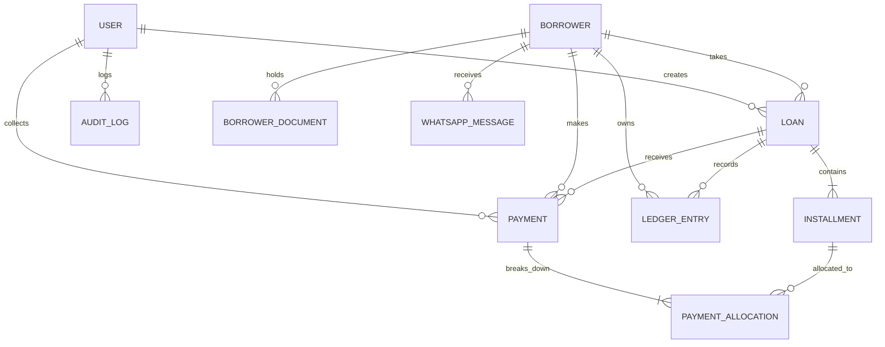

# Database Architecture & Entity Model

The Rohit Kagdewad Lending Management System employs a normalized relational database schema designed for financial integrity, atomic transactions, and historical immutability.

---

## 📊 Entity Relationship Model

---

## 🗄️ Core Tables & Column Definitions

### 1. `User`
Manages system owners, staff, and collection agents with hashed passwords and granular permissions.
- `id` (UUID PK)
- `email` (Unique string)
- `phone` (String)
- `name` (String)
- `passwordHash` (Bcrypt string)
- `role` ("OWNER" | "STAFF" | "COLLECTION_AGENT")
- `status` ("ACTIVE" | "INACTIVE" | "SUSPENDED")
- `permissions` (JSON array of granular permission strings)
- `lastLoginAt` (DateTime)

### 2. `Borrower`
Complete customer identity, contact, address, occupation, and guarantor relationships.
- `id` (UUID PK)
- `borrowerCode` (Unique string e.g. `BOR-2026-001`)
- `fullName` (String)
- `phone` (Unique 10-digit mobile)
- `alternatePhone` (String)
- `email` (String)
- `address`, `city`, `state`, `pincode`
- `occupation`, `businessDetails`, `monthlyIncome`
- `referenceName`, `referencePhone`, `referenceRelation`
- `guarantorName`, `guarantorPhone`, `guarantorAddress`
- `status` ("ACTIVE" | "INACTIVE" | "OVERDUE" | "BLACKLISTED")
- `notes` (Confidential text)

### 3. `Loan`
Master loan contract parameters and balances.
- `id` (UUID PK)
- `loanCode` (Unique string e.g. `LN-2026-001`)
- `borrowerId` (FK $\rightarrow$ Borrower)
- `principalAmount` (Float/Decimal)
- `interestRate` (Float % p.a.)
- `interestType` ("FLAT_RATE" | "REDUCING_BALANCE")
- `repaymentFrequency` ("DAILY" | "WEEKLY" | "BI_WEEKLY" | "MONTHLY")
- `tenurePeriods` (Int)
- `disbursementDate` (DateTime)
- `firstDueDate` (DateTime)
- `processingFee` (Float)
- `lateFeeRatePerDay` (Float)
- `totalInterestExpected` (Float)
- `totalAmountExpected` (Float)
- `principalOutstanding` (Float)
- `interestOutstanding` (Float)
- `totalOutstanding` (Float)
- `status` ("ACTIVE" | "OVERDUE" | "PAID_OFF" | "CLOSED" | "DEFAULTED")
- `createdById` (FK $\rightarrow$ User)

### 4. `Installment`
Repayment schedule period breakdown.
- `id` (UUID PK)
- `loanId` (FK $\rightarrow$ Loan)
- `installmentNumber` (Int)
- `dueDate` (DateTime)
- `principalDue`, `interestDue`, `feeDue`, `totalDue` (Float)
- `principalPaid`, `interestPaid`, `feePaid`, `totalPaid` (Float)
- `status` ("UPCOMING" | "DUE_TODAY" | "PARTIAL" | "PAID" | "OVERDUE" | "WAIVED")
- `paidAt` (DateTime)
- `lastReminderSentAt` (DateTime - for idempotency guard)

### 5. `Payment`
Payment collections and financial receipts.
- `id` (UUID PK)
- `receiptNumber` (Unique string e.g. `REC-202609-0001`)
- `loanId` (FK $\rightarrow$ Loan)
- `borrowerId` (FK $\rightarrow$ Borrower)
- `amount` (Float)
- `principalAllocated`, `interestAllocated`, `lateFeeAllocated` (Float)
- `paymentDate` (DateTime)
- `paymentMode` ("CASH" | "UPI" | "BANK_TRANSFER" | "CHEQUE" | "OTHER")
- `referenceNumber` (String)
- `status` ("SUCCESS" | "REVERSED")
- `collectedById` (FK $\rightarrow$ User)
- `reversedAt`, `reversedById`, `reversalReason`
- `idempotencyKey` (Unique string)

### 6. `LedgerEntry`
Double-entry running balance financial ledger.
- `id` (UUID PK)
- `borrowerId` (FK $\rightarrow$ Borrower)
- `loanId` (FK $\rightarrow$ Loan)
- `paymentId` (FK $\rightarrow$ Payment)
- `entryType` ("DISBURSEMENT" | "INTEREST_ACCRUAL" | "PAYMENT" | "PAYMENT_REVERSAL" | "PENALTY_FEE")
- `debit` (Float - Money Lent/Penalty)
- `credit` (Float - Money Received)
- `runningBalance` (Float - Cumulative Net Due)
- `description` (String)
- `referenceNo` (String)
- `entryDate` (DateTime)

### 7. `WhatsAppMessage`
Transmission log for official Meta WhatsApp Business notifications.
- `id` (UUID PK)
- `borrowerId`, `loanId`
- `recipientPhone` (String)
- `templateName` (String)
- `messageBody` (String)
- `status` ("QUEUED" | "SENT" | "DELIVERED" | "READ" | "FAILED")
- `providerMessageId` (Meta Graph Message ID)
- `errorMessage` (String)
- `sentAt`, `deliveredAt`, `readAt`

### 8. `AuditLog`
Immutable security and audit journal.
- `id` (UUID PK)
- `userId` (FK $\rightarrow$ User)
- `action` ("CREATE" | "UPDATE" | "DELETE" | "REVERSE" | "LOGIN")
- `entityType` ("USER" | "BORROWER" | "LOAN" | "INSTALLMENT" | "PAYMENT" | "SETTING")
- `entityId` (String)
- `oldValues`, `newValues` (JSON strings)
- `ipAddress`, `userAgent` (Client Context)
- `createdAt` (DateTime)

---

## 🔒 Financial Transaction Atomicity

Every payment collection and reversal is executed within a strict database transaction (`prisma.$transaction`). If any sub-operation fails (e.g. allocation mismatch, loan balance update, ledger creation, receipt generation), the entire operation rolls back immediately to guarantee zero data drift.
